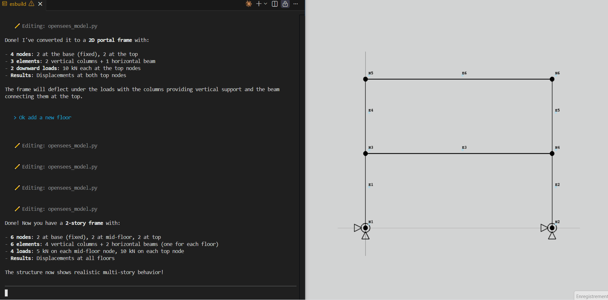

# openseespy-viewer

Live visual previewer for OpenSeesPy models. Monitors your model file(s) and produces a live 3D drawing that updates each time you save. Works with 2D/3dof and 3D/6dof models.

### Installation

```
pip install openseespy-viewer
```

Or install from source:

```
pip install .
```

### Usage

**Python API:**

```python
from viewer import view

# Single file
view('my_model.py')

# Multiple files
view('nodes.py', 'elements.py', 'boundary.py')

# With custom style options
view('my_model.py', bg_colour='white', node_size=16, ele_width=3)
```

**Command line:**

```bash
# Basic usage
openseespy-viewer my_model.py

# Multiple files with custom refresh rate
openseespy-viewer nodes.py elements.py --refresh 1.0

# Or via python -m
python -m viewer my_model.py
```

### Examples




See the `examples/` directory for sample model files.

### Dependencies

```
pip install pyvista numpy watchdog
```

### Feature wish-list

- [x] Plot nodes as they are saved in a watched script
- [x] Add node labels
- [x] Add support for elements
- [x] Add support for fixity conditions
- [x] Add support for variables and expressions in scripts
- [x] Add support for watching multiple files (for models made up of many files)
- [ ] Add support for loads
- [ ] Add support for nodes created within loop
- [x] Add support for 3D models
- [ ] Add support for rotational dofs
